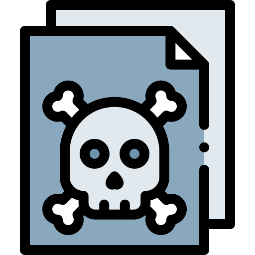

  

<h1 align="center">GhostLAN Terminal</h1>

  A terminal-style web interface developed by <strong>huwamee</strong>, built for secure, peer-to-peer communication within a local network without internet access.

## 🔐 Key Features

- **LAN-Only Messaging**  
  Operates strictly within the same local network — perfect for offline environments.

- **Internet-Free**  
  No internet required. Runs on XAMPP or any local server using localhost or local IP addresses.

- **Untraceable Communication**  
  No third-party servers, no external logs — your messages stay local and private.

- **Terminal-Style UI**  
  Retro terminal aesthetic, inspired by classic hacking tools and cyberpunk interfaces.

- **Cross-Device via Local IP**  
  Access GhostLAN Terminal from multiple devices using a LAN IP (e.g., `192.168.x.x/ghostlan`).

- **File & Image Transfer**  
  Supports sending any file type, including real-time image preview in chat.

- **Mobile-Friendly**  
  Works seamlessly on mobile browsers for chat and file sharing.

- **No Central Server Required**  
  Works peer-to-peer using shared LAN and browser access only.

- **Login System with Basic Hash Checking**  
  Lightweight user authentication layered into the system.

---

## ⚙️ Setup Instructions

### Requirements
- [XAMPP](https://www.apachefriends.org/index.html) or any local Apache server  
- PHP (included in XAMPP)  
- Shared LAN or WiFi router connection  
- Any browser (mobile or desktop)

### Installation
1. Download or clone this repository.  
2. Copy the folder into your `htdocs` directory.  
3. Start Apache via the XAMPP Control Panel.  
4. Access the interface on your browser:  
   - `http://localhost/ghostlan` (same device)  
   - `http://192.168.x.x/ghostlan` (another device on LAN)

> Tip: You can run this on an Android phone using apps like Termux + PHP server, or a local server app that supports PHP+Apache.

---

## 🎓 For Academic Use

GhostLAN Terminal is an excellent tool for **IT instructors**, **networking classes**, and **web development courses**. Here's how it can be integrated in learning environments:

- **Network Fundamentals**  
  Demonstrate LAN communication, local IP access, and server-client architecture.

- **Web Server Training**  
  Teach students to deploy PHP applications using Apache (XAMPP).

- **Cybersecurity Lessons**  
  Discuss pros/cons of untraceable communication and ethical use of local-only tools.

- **Capstone/Project Development**  
  Serve as a base project or inspiration for LAN-based chat apps or network tools.

---

## 🚧 Disclaimer

This tool is meant for **educational and ethical use only**. Misuse in academic environments (e.g., for cheating or bypassing school policies) is strongly discouraged. Be responsible and use it with integrity.

---

## 📜 License

MIT License © 2025 huwamee

Permission is hereby granted, free of charge, to any person obtaining a copy
of this software and associated documentation files (the "Software"), to deal
in the Software without restriction, including without limitation the rights
to use, copy, modify, merge, publish, distribute, sublicense, and/or sell
copies of the Software, and to permit persons to whom the Software is
furnished to do so, subject to the following conditions:

The above copyright notice and this permission notice shall be included in all
copies or substantial portions of the Software.

The software is provided "as is", without warranty of any kind, express or implied, 
including but not limited to the warranties of merchantability, fitness for a particular 
purpose, and noninfringement. In no event shall the authors or copyright holders be liable 
for any claim, damages, or other liability, whether in an action of contract, tort, or otherwise, 
arising from, out of, or in connection with the software or the use or other dealings in the software.

---

## Developed by **huwamee**
