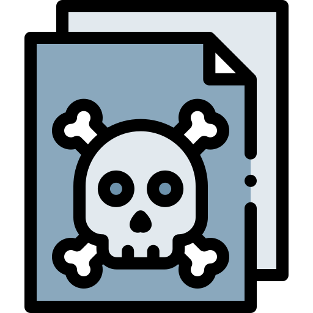

  

<h1 align="center">GhostLAN Terminal</h1>

  A terminal-style web interface developed by <strong>huwamee</strong>, built for secure, peer-to-peer communication within a local network without internet access.

## 🔐 Key Features

- **LAN-Only Messaging**  
  Operates strictly within the same local network — perfect for offline environments.

- **Internet-Free**  
  No internet required. Runs on XAMPP using localhost or local IP addresses.

- **Untraceable Communication**  
  No third-party servers, no external logs — your messages stay local and private.

- **Terminal-Style UI**  
  Retro terminal aesthetic, inspired by classic hacking tools and cyberpunk interfaces.

- **Cross-Device via Local IP**  
  Access GhostLAN Terminal from multiple devices using local IP (e.g., `192.168.x.x/ghostlan`).

---

## ⚙️ Setup Instructions

### Requirements
- [XAMPP](https://www.apachefriends.org/index.html) or any local Apache server  
- PHP (included in XAMPP)  
- Shared LAN or router connection  

### Installation
1. Download or clone this repository.  
2. Copy the folder into your `htdocs` directory.  
3. Start Apache via the XAMPP Control Panel.  
4. Access the interface on your browser:  
   - `http://localhost/ghostlan` (same device)  
   - `http://192.168.x.x/ghostlan` (another device on LAN)

---

## 🎓 For Academic Use

GhostLAN Terminal is an excellent tool for **IT instructors**, **networking classes**, and **web development courses**. Here's how it can be integrated in learning environments:

- **Network Fundamentals**  
  Demonstrate LAN communication, local IP access, and server-client architecture.

- **Web Server Training**  
  Teach students to deploy PHP applications using Apache (XAMPP).

- **Cybersecurity Lessons**  
  Discuss pros/cons of untraceable communication and ethical use of local-only tools.

- **Capstone/Project Development**  
  Serve as a base project or inspiration for LAN-based chat apps or network tools.

---

## 🚧 Disclaimer

This project is meant for **educational and ethical use only**. Misuse in academic environments (e.g., for cheating) is strongly discouraged. Be responsible.

---

## 📫 Contact

Developed by **huwamee**
